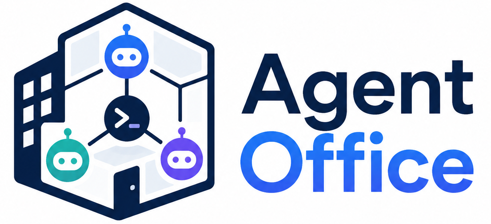

<p align="center" style="margin: 0;padding: 0;">
  
</p>
<h1 align="center" style="font-size: xxx-large; margin: 0">Agent Office</h1>
Local-first desktop workspace for running, coordinating, and observing multiple coding agents in an interactive pixel-art office.

[](https://github.com/yantodev/agent-office/actions/workflows/ci.yml) [](LICENSE)
[](https://www.electronjs.org/) [](https://react.dev/) [](https://www.typescriptlang.org/)
[](https://pixijs.com/) [](https://vite.dev/) [](https://www.sqlite.org/) [](https://github.com/microsoft/node-pty)

[Bahasa Indonesia](README.id.md)

## Overview

Agent Office is an Electron desktop application for developers who work with several coding CLIs at the same time. It combines a persistent agent registry, real pseudo-terminals, task coordination, project workspaces, and a Pixi.js office floor into one local-first experience.

The application is designed to keep project data and coordination state on the local machine while allowing optional integrations with Git, GitHub CLI, and installed coding-agent providers.

## Features

### Agent operations

- Detect installed coding CLIs, including Codex, OpenCode, Claude, Gemini, Qwen, and Copilot.
- Create reusable profiles with a role, command, and SOUL/system instructions.
- Start each agent in a real `node-pty` pseudo-terminal.
- View interactive terminal output through xterm.js.
- Steer, interrupt, pause, resume, or stop running agents.
- Recover agent state after process crashes.
- Enforce profile permissions, execution budgets, and secret redaction.
- Use provider adapters for Codex, OpenCode, Claude, Gemini, Qwen, and Copilot terminal behavior.

### Project and task coordination

- Manage projects and optional per-agent Git worktrees.
- Use a durable task board with assignment, retry, dependency, branch, artifact, result, error, and review metadata.
- Decompose missions deterministically and assign work through the Michael orchestrator.
- Schedule local heartbeats and recurring work with pause/resume controls.
- Route durable messages through an atomic mailbox with retry and dead-letter handling.
- Protect worker branches with a single-committer lock.
- Review potentially destructive, scope-changing, or costly requests through a human approval queue.

### Interactive office

- Explore a Pixi.js office floor with animated status-aware avatars.
- See each agent's workstation, including a composite desk, monitor, keyboard, CPU, chair, and desk lamp.
- Observe animated message envelopes and live agent activity.
- Use the office navigation to inspect Live Office, the selected agent, and the terminal.

### Memory and integrations

- Store shared knowledge as Markdown with SQLite FTS5 search.
- Pin and retain important memory entries.
- Optionally use deterministic local vector search.
- Import GitHub issues and prepare or create pull requests through an approval-gated `gh` workflow.
- Maintain an append-only activity log and a redacted settings-diff workflow with backup and atomic replacement.

## Tech stack

- Electron 41
- React 19 and TypeScript
- Pixi.js 8 for the interactive office floor
- xterm.js for terminal rendering
- SQLite through `better-sqlite3`
- `node-pty` for local pseudo-terminals
- Vite and electron-vite for development and bundling
- electron-builder for AppImage, NSIS, and DMG packages

## Architecture

| Layer | Responsibility |
| --- | --- |
| Main process | SQLite persistence, PTY lifecycle, filesystem and Git operations, scheduling, coordination, and integrations |
| Preload | Typed and restricted IPC bridge between Electron processes |
| Renderer | React interface, navigation, dashboards, terminal views, and Pixi.js office visualization |
| Local storage | Agent registry, task state, mailbox, events, schedules, and Markdown memory |

## Requirements

- Node.js 20 or newer is required for the browser server; Node.js 22 or newer is recommended for the Electron build.
- npm 10 or newer is recommended.
- Git for project and worktree features.
- Optional: GitHub CLI (`gh`) authenticated for GitHub workflows.
- Linux native build tools for `node-pty` and `better-sqlite3`:

```bash
sudo apt install -y build-essential python3
```

## Getting started

```bash
git clone git@github.com:yantodev/agent-office.git
cd agent-office
npm install
npm run dev
```

The development command starts the Vite renderer and launches the Electron application.

## Browser deployment

The browser client uses the same React interface through an authenticated HTTP/WebSocket gateway. The browser never receives direct filesystem or process access; project workspaces and coding CLIs remain on the web server.

For local development, copy `.env.example` to `.env`, set a strong token, and run the combined API + Vite development command. The `web:dev` and `web:server` scripts load `.env` automatically; the file is ignored by Git.

```bash
cp .env.example .env
# edit .env and replace the token
npm run web:dev
```

Open `http://localhost:5173` and enter the same token. For a production bundle, use:

```bash
npm run web:build
npm run web:server
```

The web scripts automatically check the native modules and rebuild them for the active Node runtime when needed. The first rebuild can take a few minutes on Node 20 because a prebuilt binary may not be available; install the native build tools above. If you switch back to Electron after using the browser scripts, run `npm run electron:rebuild`, because Electron and Node use different native module ABIs.

The standalone server listens on `127.0.0.1:8787` by default. Restart the web process after changing `.env`, because the token is loaded at startup. Set `AGENT_OFFICE_WEB_HOST=0.0.0.0` only when it is protected by HTTPS/WSS through a reverse proxy. `AGENT_OFFICE_WEB_DATA` selects the SQLite data directory. A production Docker image is available with `docker build -f Dockerfile.web -t agent-office-web .`; run it with a strong token and a persistent `/data` volume.

## Available scripts

| Command | Description |
| --- | --- |
| `npm run dev` | Start the Electron development environment |
| `npm run typecheck` | Run the TypeScript compiler without emitting files |
| `npm run smoke:unit` | Run isolated security, lifecycle, policy, and atomic persistence tests |
| `npm run smoke:web` | Verify authenticated web API endpoints and storage transport |
| `npm run build` | Build the main, preload, and renderer bundles |
| `npm run web:server` | Start the standalone authenticated web API |
| `npm run web:dev` | Start the web API and browser client with Vite and API/WebSocket proxy |
| `npm run web:rebuild-native` | Rebuild native modules for the active Node runtime |
| `npm run electron:rebuild` | Rebuild native modules for the installed Electron runtime |
| `npm run web:build` | Build the browser client into `dist/web` |
| `npm run web:preview` | Preview the built browser client with Vite |
| `npm run smoke:native` | Verify native dependencies and runtime behavior |
| `npm run smoke:main` | Run main-process integration smoke tests |
| `npm run smoke:migration` | Verify database migration behavior |
| `npm run dist` | Build and package for the current platform |
| `npm run dist:linux` | Build a Linux AppImage |
| `npm run dist:win` | Build a Windows NSIS installer |
| `npm run dist:mac` | Build a macOS DMG |

Before opening a pull request, run:

```bash
npm run typecheck
npm run smoke:unit
npm run smoke:native
npm run smoke:main
npm run smoke:migration
npm run build
```

## Linux troubleshooting

Some Linux installations require Electron's sandbox helper to have the correct owner and setuid permission. If Electron exits with a `chrome-sandbox` configuration error, run the following once inside the project:

```bash
sudo chown root:root node_modules/electron/dist/chrome-sandbox
sudo chmod 4755 node_modules/electron/dist/chrome-sandbox
```

Run the application as a regular user after applying the fix. In headless CI environments, `ELECTRON_DISABLE_GPU=1` may be useful when no usable GPU is available.

## Building releases

The configured application identifier is `com.agentoffice.desktop`. The default Electron icon is loaded from `assets/logo/logo.png`, while the landscape logo used by the sidebar is stored in `assets/logo/logo-landscape.png`.

Build artifacts are generated in `dist/` and are intentionally ignored by Git.

## Local data, telemetry, and backup

Agent Office keeps the SQLite registry and execution telemetry in Electron's user-data directory. Project coordination files are stored in each workspace's `.agent-office/` directory. Telemetry records task duration, output size, exit code, and redacted task results; secrets are removed before persistence. Memory retention policies can prune unpinned Markdown memories, while task and execution history remains durable until explicitly removed.

To back up a workspace safely, close Agent Office first, then copy the user-data `data/` directory together with the project's `.agent-office/` directory. Restore both directories while the application is stopped. Do not commit either location when it contains local credentials or operational history.

## Contributing

Contributions are welcome. To propose a change:

1. Fork the repository and create a focused branch.
2. Keep changes scoped and update documentation when behavior changes.
3. Run the typecheck, smoke tests, and build commands listed above.
4. Open a pull request with a concise description, validation steps, and screenshots for UI changes.

Please do not commit credentials, tokens, local settings, generated bundles, or database files. Follow the existing TypeScript conventions and prefer small, reviewable changes.

## Contributor

| Contributor | Role |
| --- | --- |
| [Yanto (@yantodev)](https://github.com/yantodev) | Creator and maintainer |

Additional contributors are welcome through pull requests.

## Security

Never place API keys, GitHub PATs, or other credentials in source files, issue reports, commits, or pull requests. Use local environment configuration and revoke any credential that is accidentally exposed.

## License

This project is licensed under the MIT License. See [LICENSE](LICENSE) for the full license text.

## Project references

- [Changelog](CHANGELOG.md)
- [Release checklist](RELEASE.md)
- [Domain context](CONTEXT.md)
- [Planned work](TODO.md)
- [Web architecture](WEB_ARCHITECTURE.md)
